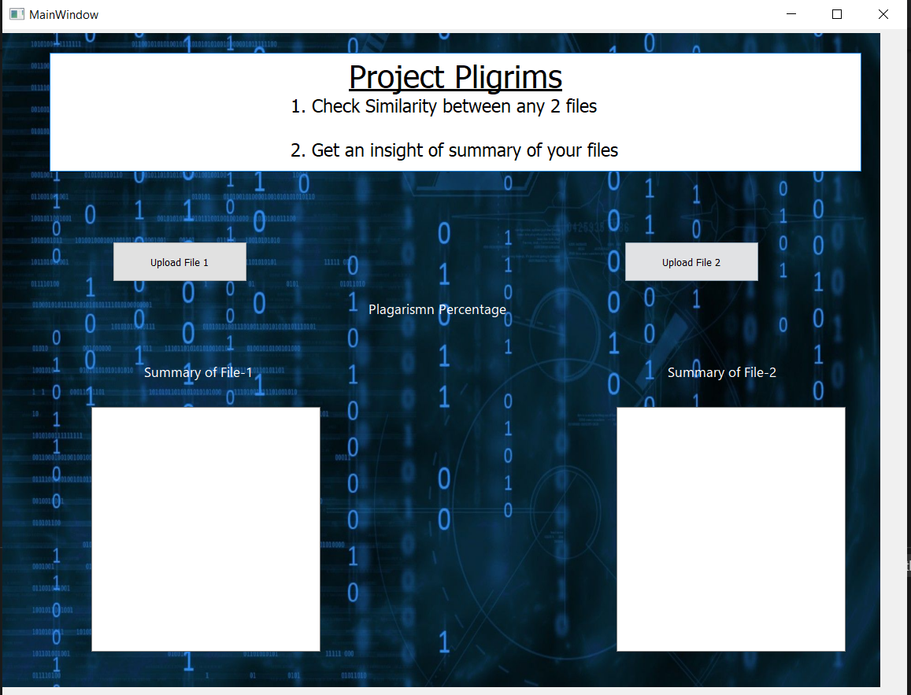

# Pligrims
- A GUI Application that takes in input 2 documents in form of pdf or txt . Accordingly it will display the similarity between the 2 documents and will give a summary of the 2 documents ie. 35 percent of it. 
- Can be also applicable for OCR as well.
- Used various techniques of NLP for text summarisation and finding similarities .
- Used PyQt5 as for the front end GUI Application which has been made with the help of QT Designer.

## Dependencies

The python version used in this project is 3.8.x.
* Python Libraries used in project:
    1. PyQt5 
    2. spacy
    3. numpy
    4. PyPDF2
    5. nltk
    6. pandas
    7. pytesseract
    8. fitz

## Executing program

After installing all the dependencies, clone the repository into your local drive and then execute the main.py file and the user-friendly interface will open.

## Contributors ✨

<!-- ALL-CONTRIBUTORS-LIST:START - Do not remove or modify this section -->
<!-- prettier-ignore-start -->
<!-- markdownlint-disable -->
<table>
  <tr>
    <td align="center"><a href="https://github.com/anshusandhi6"> <b>Anshuman Sandhibigraha</b></a> 💻</td>
    <td align="center"><a href="https://github.com/sameersahu473"> <b>Sameer Ranjan Sahu</b></a> 💻</td>
  </tr>
</table>

<!-- markdownlint-enable -->
<!-- prettier-ignore-end -->
<!-- ALL-CONTRIBUTORS-LIST:END -->

This project follows the [all-contributors](https://github.com/all-contributors/all-contributors) specification. Contributions of any kind welcome!

## Acknowledgments

* [Stack Overflow](https://stackoverflow.com)
* [Medium Articles](https://medium.com/)
* [You-Tube](https://youtube.com)

